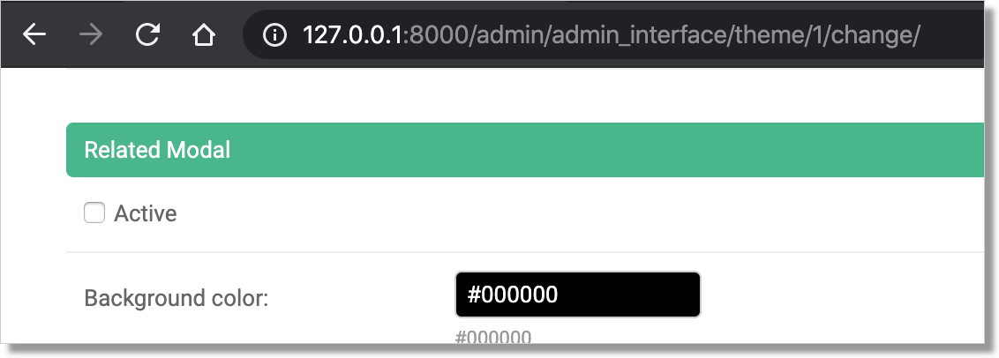
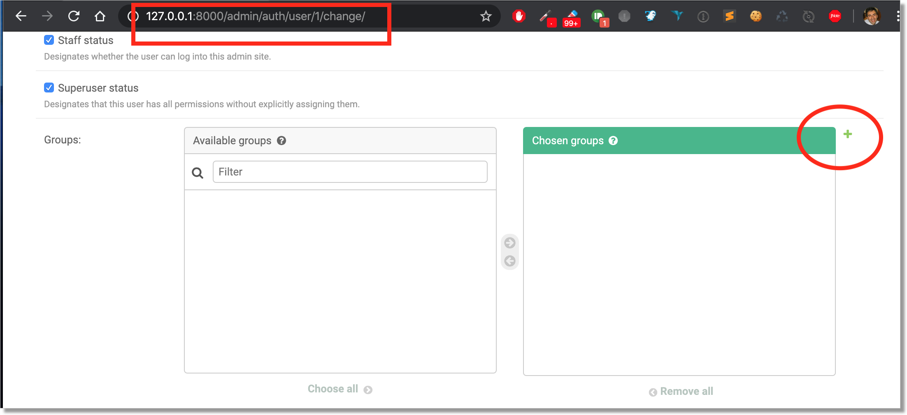
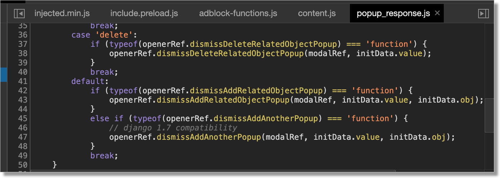

Test with::

    Django==3.0.4
    django-admin-interface==0.12.1

The "add group" popup doesn't work in User change form view, when "Related modal"
is inactive

Steps to reproduce the error
----------------------------

The error in browser inspector
------------------------------

::

    TypeError: Cannot read property 'replace' of undefined
     /static/admin/js/admin/RelatedObjectLookups.js:19

::

     Uncaught TypeError: Cannot read property 'replace' of undefined
        at windowname_to_id (:8000/static/admin/js/admin/RelatedObjectLookups.js:19)
        at dismissAddRelatedObjectPopup (:8000/static/admin/js/admin/RelatedObjectLookups.js:77)
        at popup_response.js:43
        at popup_response.js:52
